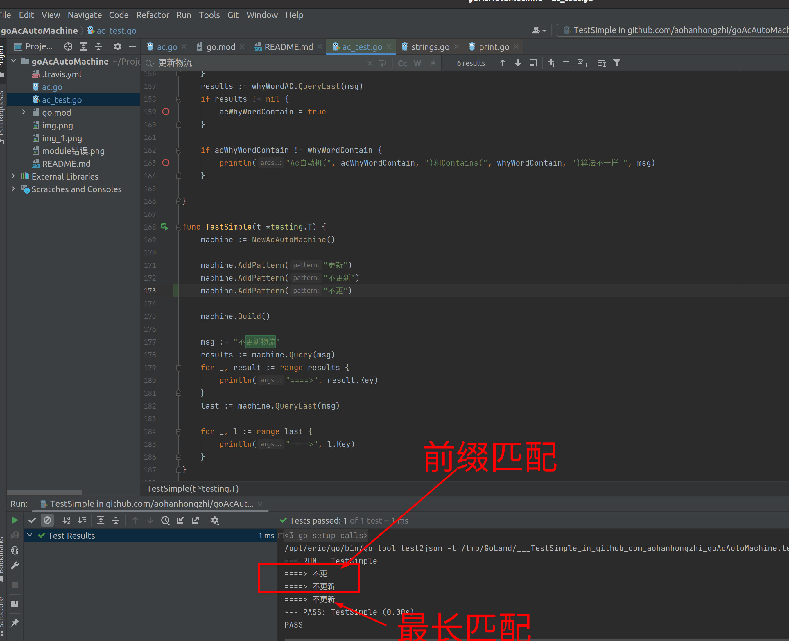
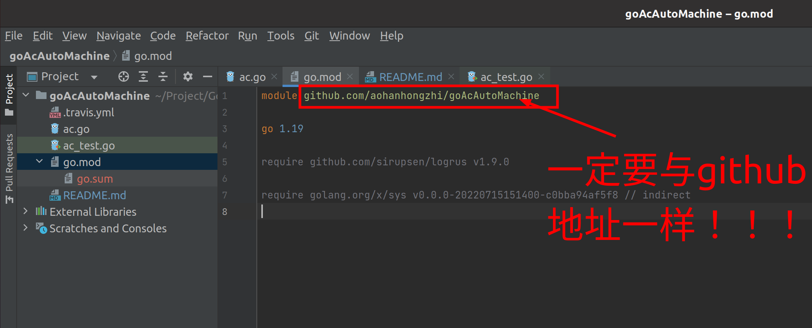
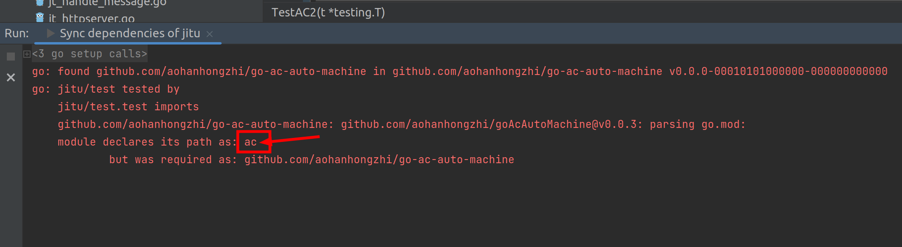
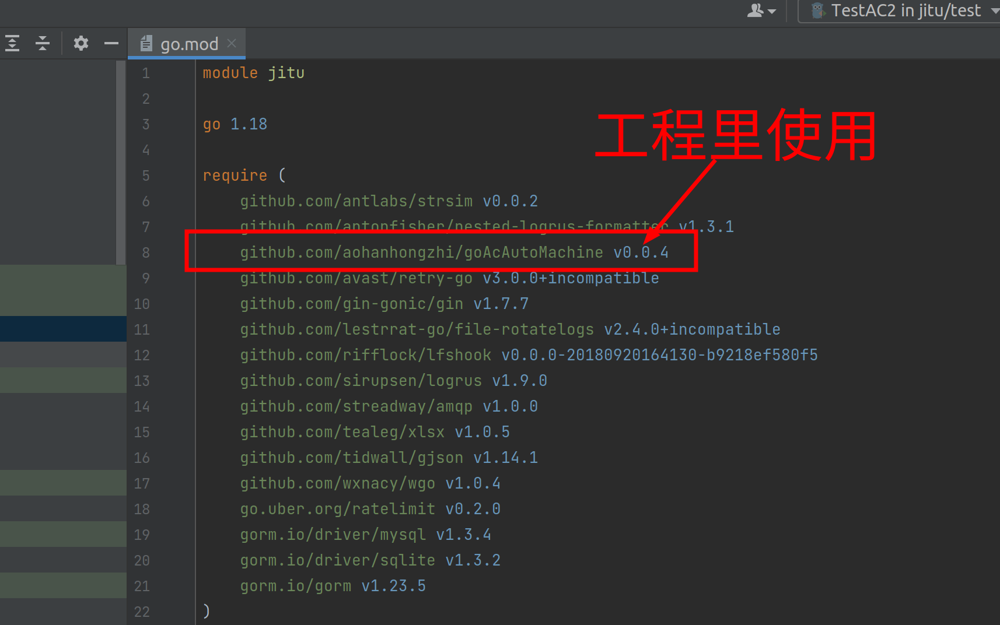

## goAcAutoMachine

[](https://travis-ci.org/zheng-ji/goAcAutoMachine)
[](https://godoc.org/github.com/zheng-ji/goAcAutoMachine)


Go 实现多模式字符串匹配的 AC 自动机

### Install

```
go get "github.com/zheng-ji/goAcAutoMachine"
```

### Example

```Go
package main

import (
    "fmt"
    "github.com/zheng-ji/goAcAutoMachine"
)

func main() {
    ac := goAcAutoMachine.NewAcAutoMachine()
    ac.AddPattern("红领巾")
    ac.AddPattern("祖国")
    ac.AddPattern("花朵")
    ac.Build()

    content := "我是红领巾，祖国未来的花朵"
    results := ac.Query(content)
    for _, result := range results {
        fmt.Println(result)
    }
}
```

### 功能解释

1. 前缀匹配，支持多个
2. 最长匹配，仅一个



> `更新`没有匹配到

### 发布自己的包

为了方便本地的开发与测试，需要mod来管理工程。



否则会发生下面错误，始终无法导入依赖！！！




#### 发布新版本

指定版本号

```shell
git tag v0.0.4
```

推送上去
```shell
git push --tags
```

#### 其他工程里使用




### License

Copyright (c) 2019 by [zheng-ji](http://zheng-ji.info) released under MIT License.
